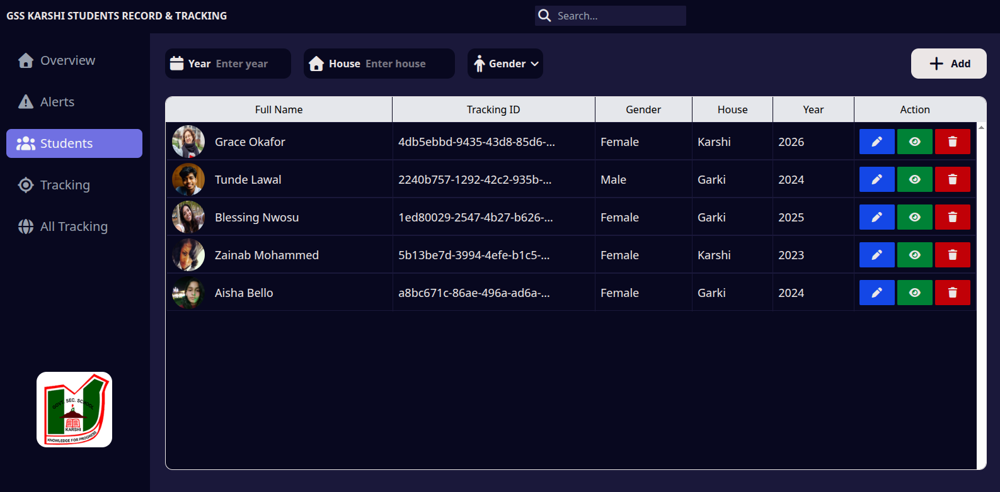
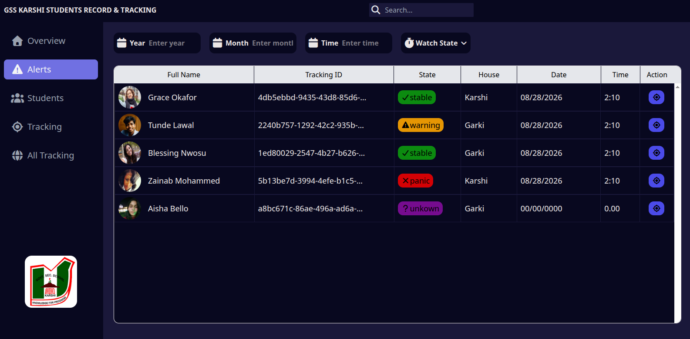
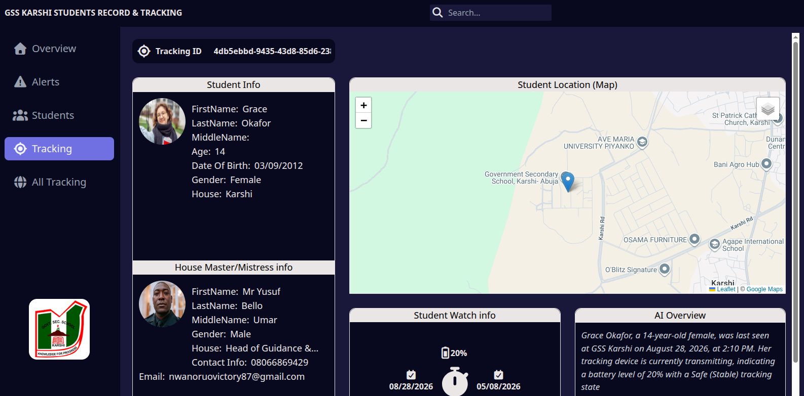
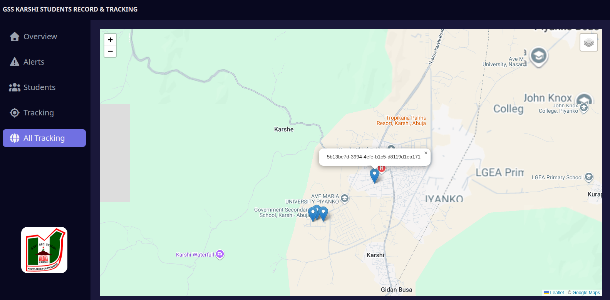

# GPS Tracking Security System - Government Secondary School Karshi

A real-time safety and GPS tracking application built to protect students at Government Secondary School Karshi through instant location monitoring, safety check-ins, and one-touch emergency alerts.

---

## Admin Board (The Board) Interface

### 1. Student Creation & Registration

This section is used to register new students into the system and view the list of currently registered individuals.

_Displays the student registration form and a data list showing the first 4 registered students._

### 2. Live Alert & State Monitor

This interface tracks the exact security status of the students in real-time, mapping them directly to their operational states.

_Displays the active tracking states (Unknown, Stable, Warning, Panic) for the 4 monitored students._

### 3. Individual Student Tracking View

Clicking on a specific student opens an in-depth profile modal or page containing comprehensive location metrics.

_Displays a map pinpointing the selected student, the exact last time/date location data was fetched, alongside device diagnostics and full student profile info._

### 4. Global Map Overview

The main command center screen showing a bird's-eye view of the entire school safety ecosystem.

_A global map displaying the real-time locations of all active students alongside the security admin board's base location._

---

## System Architecture

The infrastructure is split into three core components communicating via a dual protocol setup: **HTTP** for static management data and **TCP Sockets** for real-time live data where every millisecond counts.

### 1. The Board (Admin System)

- Used by security and administrative personnel.
- Uploads new student registration details via HTTP.
- Receives unique tracking IDs generated by the server.
- Monitors live student locations, safety check statuses, and emergency alerts.

### 2. The Tracking System (Smart Watch Client)

- Custom client application locked to the student's smart watch device.
- Operates using the validated unique tracking ID.
- Maintains a continuous TCP socket connection with the server.
- Features a prominent, single-click SOS emergency panic button.

### 3. The Server (The Brain)

- **HTTP Protocol:** Handles static data requests, such as registering a new student and issuing tracking IDs.
- **TCP Socket Protocol:** Manages real-time data streams, including live location pings, safety verification responses, and SOS panic triggers.

---

## How It Works

1. **Student Registration:** Admins input student info into **The Board**, which sends an HTTP request to the server to generate a **unique tracking ID**.
2. **Device Activation:** The tracking ID is inserted into the student's smart watch application. The watch validates the ID against the server.
3. **Connection Handshake:** Once validated, the watch opens the emergency SOS screen and establishes a live TCP socket handshake with the server.
4. **Active Monitoring:** The server tracks the student and runs safety protocols in real time.

---

## Core Features

- **Live Location Tracking:** The server pings connected watches every 20 seconds to log real-time coordinates and movement.
- **Safety Verification:** The server periodically sends an "Are you safe?" alert prompt to the watch. Students must click **OK** to confirm safety or **Cancel** if in distress.
- **Emergency SOS Panic Button:** A dedicated physical/screen button on the watch that immediately fires a high-priority panic alert over the socket connection to security personnel.

---

## Student Status States

The system categorizes every student into one of four distinct states based on device feedback:

1. **Unknown State:** The student is registered on the server via HTTP, but the tracking device has not connected or sent any data yet.
2. **Stable State:** The system actively receives location updates and device pings. Everything is normal.
3. **Warning State:** The student fails to respond to or validate a periodic "Are you safe?" safety verification prompt.
4. **Panic / Emergency State:** The student triggers the SOS button, instantly notifying security with live location data for rapid response.
